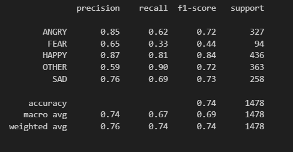
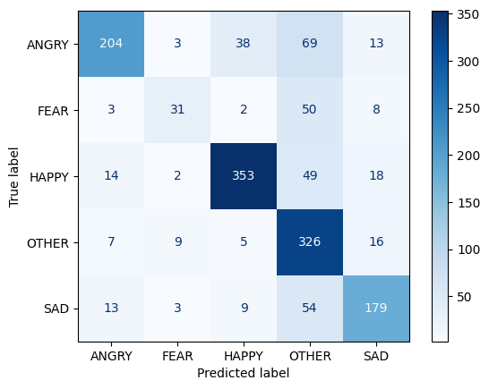
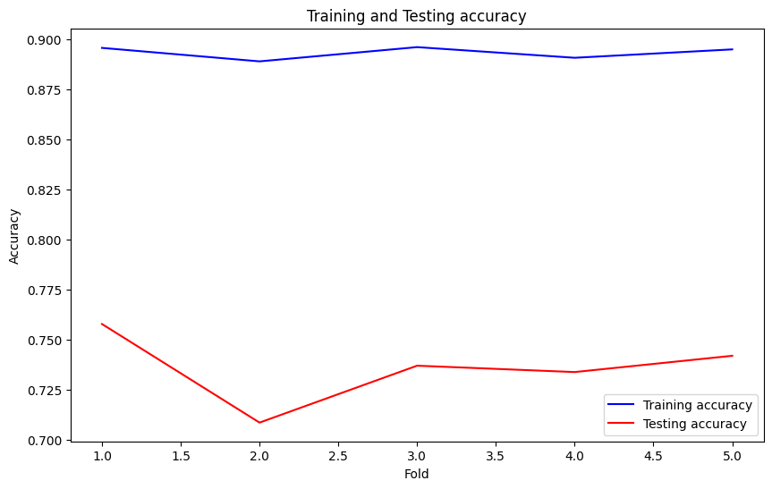

# Persian Text Emotion Analysis

---

## Abstract
Emotion detection in Persian texts is a critical task in Natural Language Processing (NLP) with applications ranging from user feedback analysis to software product improvement. This study presents a **single-label emotion classification model** that categorizes Persian texts into five classes: **happiness, sadness, anger, fear, and others**. Machine learning algorithms including **Random Forest, AdaBoost, Gradient Boosting, and Support Vector Machines (SVM)** were explored, combined with data preprocessing, augmentation, and feature engineering using **fastText embeddings**. An ensemble learning approach was applied, and model performance was evaluated using standard metrics on both validation and unseen test sets.

---

## 1. Introduction
Emotion detection in Persian texts is a fundamental NLP task with numerous practical applications, including improving customer satisfaction and increasing sales by analyzing user comments.  

Emotion classification can be approached using classical sentiment analysis, machine learning models, or deep learning techniques, including large language models (LLMs). While deep learning models often achieve higher accuracy, they are computationally expensive and require longer inference times.  

This work investigates machine learning methods to perform emotion classification efficiently and interprets their performance in a structured pipeline.

---

## 2. Data Collection and Preparation

### 2.1 Data Acquisition
The dataset was provided in an Excel file. For clarity, two columns were defined: `"text"` for the text content and `"emotion"` for the corresponding label.

### 2.2 Data Preprocessing
Preprocessing Persian text is essential for robust model performance. The following steps were applied:

- **Normalization:** Using the [Hazm library](https://github.com/sobhe/hazm) for tokenization, stemming, and lemmatization.  
- **Text Cleaning:** 
  - Standardizing letters.
  - Removing repeated characters (e.g., "خوووب" → "خوب").  
  - Removing punctuation, emojis, and extra symbols.  
  - Converting uppercase letters to lowercase.  
- **Emoji and Special Character Handling:** Emojis and special characters were replaced with meaningful tokens.

### 2.3 Data Augmentation
To mitigate limited dataset size, **data augmentation** was applied:

1. **Reduce Overfitting:** Diverse samples help the model generalize patterns rather than memorize specific instances.  
2. **Increase Accuracy:** Augmented data allows the model to recognize more features and patterns.  
3. **Improve Generalization:** Exposure to diverse data ensures better performance on unseen texts.

### 2.4 Feature Engineering with fastText
Machine learning models require numeric representations of text:

- Words were converted to **embedding vectors** using **fastText**, preserving semantic relationships.  
- Each text was transformed into a numeric vector for model training.  
- Alternative approaches like TF-IDF or Word2Vec were considered, but fastText provided effective embeddings for Persian text.

---

## 3. Model Selection and Hyperparameter Optimization

### 3.1 Ensemble Learning
An **ensemble learning** approach was applied to improve classification performance. Multiple models were trained on the same dataset, and their predictions were **combined using a voting mechanism** to determine the final class label.  

This technique leverages the strengths of individual models and reduces the risk of overfitting by aggregating multiple perspectives.

### 3.2 Grid Search for Hyperparameter Tuning
- **Grid search** was employed to fine-tune model hyperparameters.  
- All combinations of predefined hyperparameters were evaluated to identify the best configuration for **Random Forest, AdaBoost, Gradient Boosting, and SVM**.

### 3.3 Multi-Model Classification
The ensemble was implemented using the **VotingClassifier** from scikit-learn. Predictions from multiple models were aggregated, assigning the final class based on **majority voting** or **probability averaging**.

---

## 4. Training Pipeline
A **comprehensive training pipeline** was implemented:

1. **Input Transformation:** Texts were converted into feature vectors using embeddings.  
2. **Probability Vector Generation:** Each model outputs a probability vector for class membership.  
3. **Voting Mechanism:** The VotingClassifier combines probabilities to assign a final label.

### 4.1 Validation and Overfitting Prevention
- The dataset was split into **training and test sets**, with 15% reserved for testing.  
- Model performance was continuously monitored on the validation set to prevent overfitting and ensure generalization.

---

## 5. Model Evaluation and Results

### 5.1 Evaluation on Test Data
The final model was evaluated on a **previously unseen test set** to estimate real-world performance.  

  

### 5.2 Confusion Matrix
- A **confusion matrix** visualized performance across emotion classes.  
- Some texts belonging to the four primary emotions were misclassified as **"other"**, highlighting areas for potential improvement.  

  

### 5.3 Error Analysis
- Common misclassifications were identified.  
- Techniques such as **boosting** or **bagging** were suggested to improve performance.  
- Fine-tuning specific classifiers could mitigate recurring errors.

  

---

## 6. Inference on New Data
- The trained model was applied to **new data** from a CSV file.  
- Predictions were saved to `prediction.csv` with columns:  
  - `X`: Original text  
  - `Y`: Predicted emotion label  

This ensures **reproducibility** and facilitates further analysis or downstream applications.

---

## 7. Conclusion
This study presented a complete pipeline for **Persian text emotion detection**, from preprocessing and data augmentation to model training, evaluation, and inference. Ensemble learning combined with hyperparameter optimization improved classification performance. The final model demonstrates strong generalization and provides a foundation for future improvements in Persian NLP emotion analysis.

---

## References
1. [Hazm: Python library for Persian NLP](https://github.com/sobhe/hazm)  
2. [fastText: Efficient text embeddings](https://fasttext.cc/)  
3. Pedregosa et al., “Scikit-learn: Machine Learning in Python”, Journal of Machine Learning Research, 2011.
